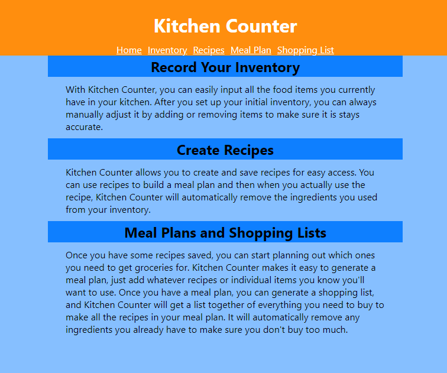
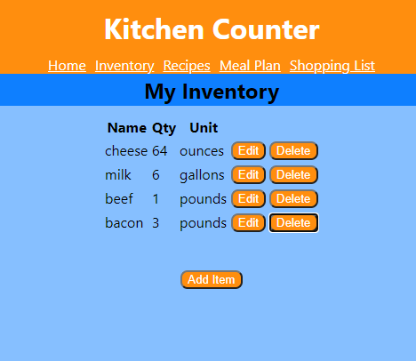
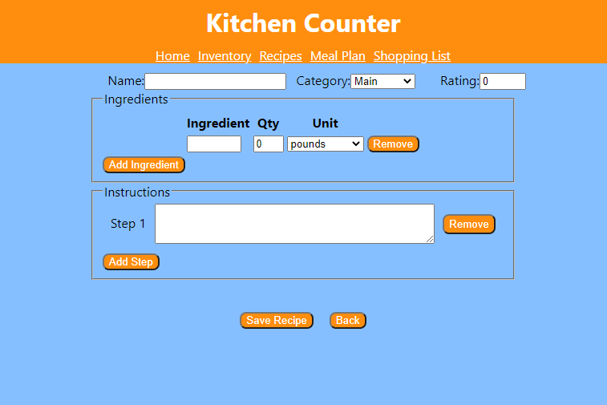
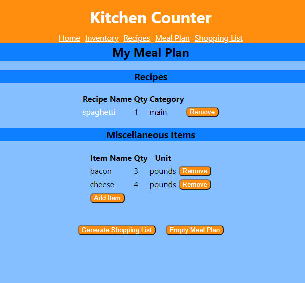
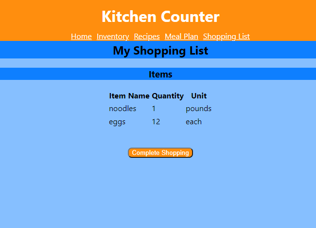

# Kitchen Counter
Live App: https://kitchen-counter.vercel.app/
Server Repository: https://github.com/Leojanas/kitchen-counter-api

This app was created with React in the front end, and uses a back end built with Node.js, Express, and PostgreSQL.

## Summary

Kitchen Counter is a food inventory tracking app developed with React from create-react-app.  
The app can accept inventory items and quantities and can also accept recipes with ingredient lists and instructions.  Using a recipe will automatically deduct the ingredient from the inventory, and the inventory can also be manually adjusted to account for using individual items.
Individual items and/or recipes can also be added to a Meal Plan.  This mealplan can then be used to generate a shopping list by comparing it to the current inventory.  The inventory is then automatically updated to reflect the shopping list being used.

## Screenshots

This shows the home screen, which gives users instructions on how to use the app. The nav links at the top use React Router to take the user to the other sections of the app.

This shows the inventory list, which lets the user see and adjust what they currently have on hand.

This shows the form to add a recipe.

This shows the mealplan screen, where users can view their meal plan and add items. Recipes are added from the recipe list screen.

This shows the shopping list screen, where users can see all the items they need to buy to be able to use their entire mealplan.
